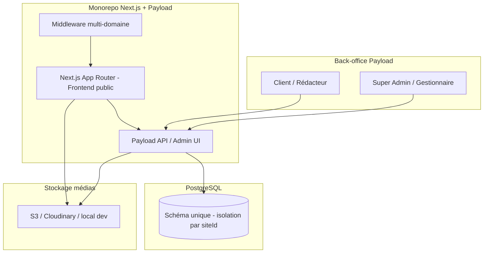
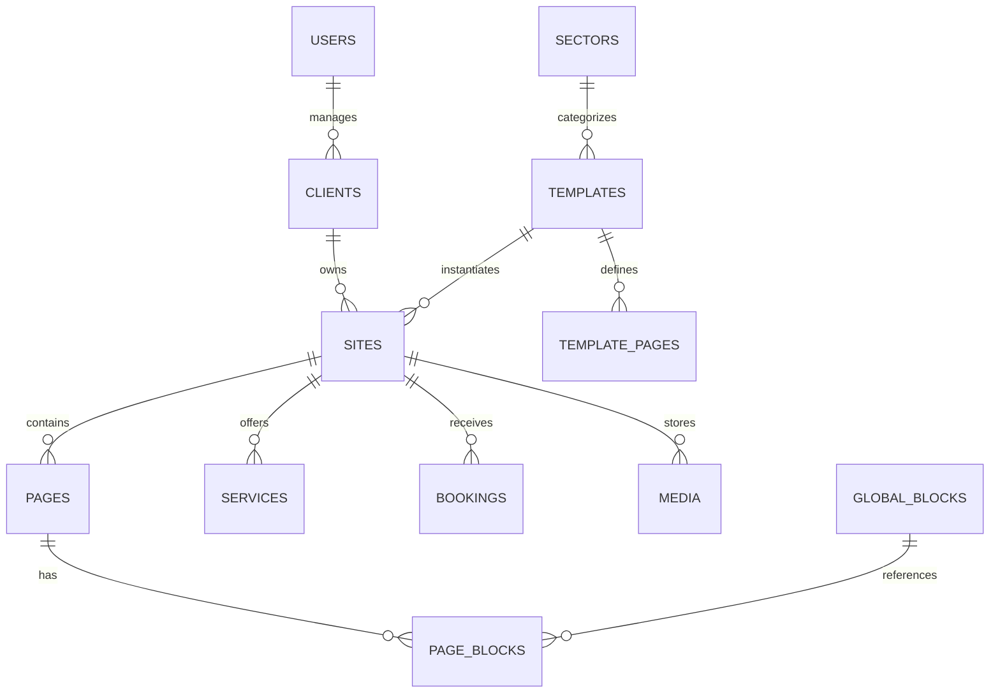
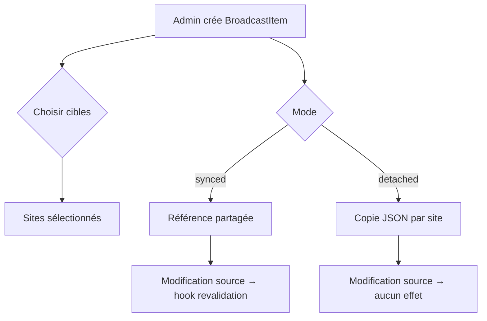

# Document d'architecture — Usine à sites web multi-tenant

**Projet :** Plateforme « Usine à sites »  
**Stack :** Payload CMS 3.x · Next.js 15 (App Router) · PostgreSQL · (futur : n8n + IA)  
**État du workspace :** greenfield  
**Date :** 30 juin 2026

---

## Contexte et décision d'adaptation

Le workspace part d'une **base vierge** avec une structure monorepo unique recommandée : une application Next.js embarquant Payload CMS (pattern officiel Payload 3), une base PostgreSQL partagée, et un déploiement évolutif vers multi-domaines.

**Principe directeur V1 :** livrer un flux complet (création client → site → affichage public → réservation) avec une logique de contenu partagé **simplifiée**, sans implémenter le broadcast complet dès la V1.

---

## 1. Architecture générale du projet

### 1.1 Vue d'ensemble



### 1.2 Structure monorepo recommandée

```
usine-a-site/
├── src/
│   ├── app/
│   │   ├── (payload)/          # Routes admin Payload (/admin, /api)
│   │   ├── (public)/           # Frontend public multi-tenant
│   │   │   └── [[...slug]]/    # Catch-all par domaine
│   │   └── api/                # Routes custom si besoin
│   ├── collections/            # Définitions Payload
│   ├── blocks/                 # Blocs réutilisables (Page Blocks)
│   ├── globals/                # Contenu global V1 simplifié
│   ├── hooks/                  # Hooks Payload (site creation, broadcast...)
│   ├── access/                 # Contrôle d'accès par rôle
│   ├── lib/
│   │   ├── tenant/             # Résolution site par domaine
│   │   ├── templates/          # Logique copie template → site
│   │   └── broadcast/          # Logique propagation (V1 simplifiée)
│   ├── components/             # Composants React frontend
│   └── payload.config.ts
├── migrations/                   # Migrations Drizzle/Payload
├── seed/                         # Template fleuriste + données démo
├── docker-compose.yml            # PostgreSQL local
└── .env
```

### 1.3 Flux métier principal

```
┌─────────────┐    ┌──────────────┐    ┌─────────────┐    ┌──────────────┐
│ Connexion   │───▶│ Créer Client │───▶│ Créer Site  │───▶│ Choisir      │
│ Payload     │    │              │    │ + secteur   │    │ Template     │
└─────────────┘    └──────────────┘    └─────────────┘    └──────┬───────┘
                                                                    │
                    ┌───────────────────────────────────────────────┘
                    ▼
         ┌────────────────────┐    ┌─────────────────┐    ┌─────────────┐
         │ Hook afterChange   │───▶│ Copie pages +   │───▶│ Site        │
         │ Site (status draft)│    │ blocs template  │    │ publié      │
         └────────────────────┘    └─────────────────┘    └──────┬──────┘
                                                                    │
                    ┌───────────────────────────────────────────────┘
                    ▼
         ┌────────────────────┐    ┌─────────────────┐
         │ Visiteur accède    │───▶│ Next.js résout  │
         │ fleuriste-martin.fr│    │ domaine → site  │
         └────────────────────┘    └─────────────────┘
```

### 1.4 Choix techniques clés

| Composant | Choix V1 | Justification |
|-----------|----------|---------------|
| CMS | Payload 3.x embarqué dans Next.js | Un seul déploiement, SSR/ISR natif |
| BDD | `@payloadcms/db-postgres` | Relationnel, requêtes complexes, évolutif |
| Multi-tenant | Champ `site` sur collections scopées + middleware domaine | Plus simple que le plugin officiel pour le modèle Client→Site |
| Rendu public | ISR (`revalidate`) + on-demand revalidation | Performance + fraîcheur contenu |
| Médias | Upload Payload → S3 en prod, local en dev | Isolation par dossier `sites/{siteId}/` |
| Auth | Users Payload + rôles custom | Suffisant V1 |

> **Note plugin multi-tenant Payload :** Le plugin `@payloadcms/plugin-multi-tenant` ajoute un sélecteur de tenant dans l'admin. Il peut être adopté en V2 en mappant la collection `Sites` comme tenant. En V1, un champ relation `site` explicite reste plus lisible pour le modèle Client/Site/Template.

---

## 2. Modèle de données Payload

### 2.1 Entités principales et granularité



### 2.2 Enums globaux

```typescript
// Statut de publication
type PublishStatus = 'draft' | 'published' | 'archived'

// Niveau de contenu (3 niveaux broadcast-like)
type ContentScope = 'global' | 'template' | 'site'

// Mode de liaison broadcast (V1 : global uniquement ; V2 : complet)
type BroadcastMode = 'synced' | 'detached'

// Rôles utilisateurs
type UserRole =
  | 'super-admin'
  | 'internal-manager'
  | 'client'
  | 'editor'
  | 'viewer'

// Statut réservation
type BookingStatus = 'pending' | 'confirmed' | 'cancelled' | 'completed'
```

### 2.3 Champs transverses (pattern)

Chaque document scopé « site » inclut :

```typescript
{
  site: Relationship → Sites,        // obligatoire, indexé
  status: PublishStatus,             // draft | published | archived
  _status?: 'draft' | 'published',   // versions Payload (draft/publish natif)
  createdBy: Relationship → Users,
  updatedAt, createdAt
}
```

Chaque document « template » inclut :

```typescript
{
  template: Relationship → Templates,
  contentScope: 'template',          // fixe
}
```

---

## 3. Collections nécessaires

### 3.1 Collections V1 (obligatoires)

#### `users` (auth Payload)

| Champ | Type | Notes |
|-------|------|-------|
| `email` | email | Login |
| `password` | password | Hashé |
| `role` | select | Enum `UserRole` |
| `clients` | relationship[] → Clients | Pour rôle `client` / `editor` |
| `sites` | relationship[] → Sites | Accès restreint par site |
| `firstName`, `lastName` | text | Affichage admin |

**Access :** Super-admin tout ; client limité à ses `sites`.

---

#### `clients`

| Champ | Type | Notes |
|-------|------|-------|
| `name` | text | Ex. « Fleuriste Martin SARL » |
| `slug` | text | Unique, URL interne |
| `contactEmail` | email | |
| `contactPhone` | text | |
| `billingAddress` | group | adresse, ville, CP, pays |
| `status` | select | `active` \| `inactive` |
| `notes` | textarea | Interne |

---

#### `sectors`

| Champ | Type | Notes |
|-------|------|-------|
| `name` | text | Ex. « Fleuriste » |
| `slug` | text | `fleuriste` |
| `icon` | upload → media | Optionnel |
| `description` | textarea | |

> Collection légère, peu de documents. Peut être un simple select sur `Templates` en V1 si on veut réduire.

---

#### `templates`

| Champ | Type | Notes |
|-------|------|-------|
| `name` | text | Ex. « Template Fleuriste » |
| `slug` | text | `fleuriste-v1` |
| `sector` | relationship → Sectors | |
| `description` | textarea | |
| `previewImage` | upload | Capture écran |
| `defaultTheme` | group | Voir ci-dessous |
| `defaultPages` | array | Structure pages par défaut |
| `defaultBlocks` | blocks[] | Blocs template (JSON) |
| `isActive` | checkbox | Disponible à la création |

**Groupe `defaultTheme` :**

```typescript
{
  primaryColor: '#2D5A27',
  secondaryColor: '#F5E6D3',
  accentColor: '#C41E3A',
  fontHeading: 'Playfair Display',
  fontBody: 'Inter',
  borderRadius: 'medium', // small | medium | large
}
```

**Array `defaultPages` :**

```typescript
{
  title: 'Accueil',
  slug: '',              // homepage
  isHomepage: true,
  blocks: blocks[],      // copiés à la création
  seo: { title, description }
}
```

---

#### `sites` (cœur du multi-tenant)

| Champ | Type | Notes |
|-------|------|-------|
| `name` | text | Ex. « Fleuriste Martin » |
| `slug` | text | `fleuriste-martin` |
| `client` | relationship → Clients | Propriétaire |
| `template` | relationship → Templates | Modèle source |
| `sector` | relationship → Sectors | Hérité du template |
| `status` | select | `draft` \| `published` \| `archived` |
| `domain` | text | `fleuriste-martin.fr` (unique) |
| `subdomain` | text | `fleuriste-martin` → `{sub}.plateforme.fr` |
| `useCustomDomain` | checkbox | |
| **Identité** | | |
| `logo` | upload → media | |
| `favicon` | upload | |
| `theme` | group | Surcharge du defaultTheme template |
| **Contact** | | |
| `contact` | group | phone, email, address, hours (JSON structuré) |
| `socialLinks` | array | platform + url |
| **SEO global site** | | |
| `seo` | group | defaultTitle, description, ogImage |
| **Métadonnées** | | |
| `publishedAt` | date | |
| `clonedFromTemplateAt` | date | Horodatage copie initiale |
| `templateVersion` | text | Traçabilité |

**Groupe `contact.hours` (V1) :**

```typescript
{
  monday: { open: '09:00', close: '19:00', closed: false },
  // ... autres jours
  specialNote: 'Fermé les jours fériés'
}
```

---

#### `pages`

| Champ | Type | Notes |
|-------|------|-------|
| `site` | relationship → Sites | **Index obligatoire** |
| `title` | text | |
| `slug` | text | Unique par site |
| `isHomepage` | checkbox | Un seul par site (hook validation) |
| `status` | select | PublishStatus |
| `layout` | blocks[] | Page Blocks |
| `seo` | group | title, description, noIndex |
| `sourceTemplatePageId` | text | ID page template d'origine (traçabilité) |
| `contentScope` | select | `site` (défaut) \| `template` (pages template only) |
| `broadcastRef` | relationship → GlobalBlocks | V1 : lien optionnel vers bloc global |

**Contrainte :** Index composite unique `(site, slug)`.

---

#### `services`

| Champ | Type | Notes |
|-------|------|-------|
| `site` | relationship → Sites | |
| `title` | text | Ex. « Bouquets sur mesure » |
| `slug` | text | |
| `description` | richText | |
| `shortDescription` | textarea | Carte liste |
| `image` | upload | |
| `price` | group | from, to, currency, onRequest |
| `featured` | checkbox | Affiché en homepage |
| `order` | number | Tri |
| `status` | select | PublishStatus |

---

#### `bookings` (réservations / demandes)

| Champ | Type | Notes |
|-------|------|-------|
| `site` | relationship → Sites | |
| `status` | select | BookingStatus |
| `customerName` | text | |
| `customerEmail` | email | |
| `customerPhone` | text | |
| `eventDate` | date | Date livraison / événement |
| `eventType` | select | `delivery` \| `wedding` \| `funeral` \| `other` |
| `message` | textarea | Détails demande |
| `budget` | number | Optionnel |
| `sourcePage` | text | URL référente |
| `submittedAt` | date | Auto |
| `internalNotes` | textarea | Admin only |

> Créée via endpoint Payload REST depuis formulaire public (pas d'auth visiteur).

---

#### `media`

| Champ | Type | Notes |
|-------|------|-------|
| `site` | relationship → Sites | Nullable pour médias template/global |
| `alt` | text | SEO |
| `caption` | text | |
| `scope` | select | `global` \| `template` \| `site` |

**Hook upload :** préfixer le chemin `sites/{siteId}/` pour isolation S3.

---

### 3.2 Collections V1 simplifiées (contenu partagé)

#### `global-blocks` (V1 — remplace broadcast complet)

| Champ | Type | Notes |
|-------|------|-------|
| `name` | text | Ex. « Footer mentions légales » |
| `slug` | text | `legal-footer` |
| `type` | select | `footer` \| `legal` \| `cookie-banner` \| `cta` |
| `content` | blocks[] ou richText | Selon type |
| `autoApplyToNewSites` | checkbox | Injecté à la création |
| `targetSites` | relationship[] → Sites | Sites concernés |
| `mode` | select | `synced` \| `detached` |

**Comportement V1 :**

- `synced` : le bloc est **référencé** par les pages (relation). Modification du global → revalidation ISR des sites ciblés.
- `detached` : copie JSON figée à l'assignation (pas de propagation).

---

### 3.3 Collections V2+ (hors scope V1, prévoir le schéma)

| Collection | Rôle |
|------------|------|
| `products` | Catalogue e-commerce futur |
| `blog-posts` | Blog par site |
| `form-submissions` | Formulaires génériques |
| `seo-settings` | Global SEO avancé (redirections, schema.org) |
| `navigation` | Menus configurables |
| `legal-pages` | CGV, mentions légales dédiées |
| `broadcast-items` | Broadcast complet multi-sites |

---

### 3.4 Blocs Payload (`blocks/`)

Blocs V1 pour template fleuriste :

| Bloc | Usage |
|------|-------|
| `hero` | Bannière accueil (titre, sous-titre, image, CTA) |
| `services-grid` | Grille services (auto ou manuel) |
| `text-image` | Section classique |
| `gallery` | Galerie photos |
| `testimonials` | Témoignages |
| `cta-banner` | Appel à l'action |
| `contact-info` | Coordonnées + horaires |
| `booking-form` | Formulaire réservation embarqué |
| `map` | Carte / adresse |
| `rich-text` | Contenu libre |
| `global-block-ref` | Référence vers `global-blocks` |

Chaque bloc expose un champ `blockName` (admin) et des champs éditables par le client.

---

## 4. Relations entre collections

```mermaid
flowchart LR
    subgraph Platform["Niveau plateforme"]
        U[Users]
        SEC[Sectors]
        TPL[Templates]
        GB[GlobalBlocks]
    end

    subgraph ClientLevel["Niveau client"]
        CL[Clients]
    end

    subgraph SiteLevel["Niveau site = tenant"]
        ST[Sites]
        PG[Pages]
        SV[Services]
        BK[Bookings]
        MD[Media]
    end

    U -->|clients[]| CL
    U -->|sites[]| ST
    CL -->|1:N| ST
    SEC -->|1:N| TPL
    TPL -->|1:N| ST
    ST -->|1:N| PG
    ST -->|1:N| SV
    ST -->|1:N| BK
    ST -->|1:N| MD
    GB -->|targetSites[]| ST
    PG -->|broadcastRef| GB
    PG -->|layout blocks| MD
    SV -->|image| MD
    ST -->|logo, favicon| MD
```

### Tableau des cardinalités

| Relation | Cardinalité | Cascade |
|----------|-------------|---------|
| Client → Sites | 1:N | Archiver client → archiver sites |
| Template → Sites | 1:N | Pas de cascade (sites indépendants après copie) |
| Site → Pages | 1:N | Supprimer site → supprimer pages |
| Site → Services | 1:N | Idem |
| Site → Bookings | 1:N | Conserver bookings (audit) même si site archivé |
| Site → Media | 1:N | Supprimer médias orphelins via hook |
| GlobalBlock → Sites | N:M | Retrait site → déréférencer, pas supprimer page |
| User → Sites | N:M | Contrôle accès |

### Index PostgreSQL recommandés

```sql
-- Performance requêtes publiques
CREATE UNIQUE INDEX idx_sites_domain ON sites(domain) WHERE domain IS NOT NULL;
CREATE UNIQUE INDEX idx_sites_subdomain ON sites(subdomain);
CREATE UNIQUE INDEX idx_pages_site_slug ON pages(site_id, slug);
CREATE INDEX idx_pages_site_status ON pages(site_id, status);
CREATE INDEX idx_services_site_featured ON services(site_id, featured);
CREATE INDEX idx_bookings_site_status ON bookings(site_id, status);
```

---

## 5. Logique multi-sites / multi-tenant

### 5.1 Stratégie : « Site as Tenant »

Chaque **Site** est l'unité d'isolation. Pas de base par client, pas de schéma PostgreSQL séparé en V1.

```
                    ┌─────────────────────────────────────┐
                    │         PostgreSQL (unique)          │
                    │  ┌─────────┐  ┌─────────┐          │
                    │  │ Site A  │  │ Site B  │  ...     │
                    │  │ pages   │  │ pages   │          │
                    │  │ services│  │ services│          │
                    │  └─────────┘  └─────────┘          │
                    └─────────────────────────────────────┘
                              ▲
                    filtre WHERE site = :siteId
```

### 5.2 Résolution du tenant (Next.js middleware)

```typescript
// src/middleware.ts — logique conceptuelle

1. Lire hostname de la requête (ex. fleuriste-martin.fr)
2. Chercher en cache (Redis/Vercel KV) : hostname → siteId
3. Si miss : requête Payload GET /api/sites?where[domain][equals]=hostname
4. Injecter headers : x-site-id, x-site-slug
5. Rewrite vers /(public)/[siteSlug]/[...slug] OU passer siteId en header
```

**Environnements :**

| Env | Résolution |
|-----|------------|
| Dev local | `?site=fleuriste-martin` ou sous-domaine `*.localhost` |
| Staging | `{slug}.staging.plateforme.fr` |
| Prod | Domaine custom ou sous-domaine plateforme |

### 5.3 Contrôle d'accès Payload (`access/`)

```typescript
// Pattern pour collections scopées site
const siteScopedRead = ({ req }) => {
  if (req.user?.role === 'super-admin') return true
  if (req.user?.role === 'internal-manager') return true
  return {
    site: { in: req.user.sites.map(s => s.id) }
  }
}

// Bookings : client peut lire, pas supprimer
// Pages/Services : editor peut update, viewer read-only
```

### 5.4 Matrice rôles × actions

| Rôle | Clients | Sites | Pages | Services | Bookings | Templates | Global |
|------|---------|-------|-------|----------|----------|-----------|--------|
| Super Admin | CRUD | CRUD | CRUD | CRUD | CRUD | CRUD | CRUD |
| Gestionnaire interne | CRUD | CRUD | CRUD | CRUD | RU | R | RU |
| Client | R (sien) | RU (sien) | RU | RU | R | — | — |
| Rédacteur | — | R (assigné) | RU | RU | R | — | — |
| Viewer | — | R | R | R | R | — | — |

### 5.5 Isolation médias

- Upload avec `site` obligatoire pour rôle client.
- URL publique : `/media/sites/{siteId}/{filename}` ou CDN signé.
- Requête média : vérifier que `media.site === currentSite`.

---

## 6. Logique de templates

### 6.1 Les 3 niveaux de contenu

```
┌──────────────────────────────────────────────────────────────────┐
│ NIVEAU 1 — GLOBAL (global-blocks)                                │
│ Mentions légales, footer, cookies                                │
│ Modifiable une fois → propagation aux sites en mode "synced"     │
├──────────────────────────────────────────────────────────────────┤
│ NIVEAU 2 — TEMPLATE (templates.defaultPages + defaultBlocks)     │
│ Structure : pages Accueil, Bouquets, Mariage, Contact...         │
│ COPIÉ une fois à la création du site → devient contenu site      │
├──────────────────────────────────────────────────────────────────┤
│ NIVEAU 3 — SITE (pages, services, theme, contact...)             │
│ Spécifique client. Jamais écrasé automatiquement après création  │
└──────────────────────────────────────────────────────────────────┘
```

### 6.2 Hook de création de site

```typescript
// collections/Sites/hooks/afterChange.ts

async function onSiteCreate(site, { req, operation }) {
  if (operation !== 'create') return

  const template = await req.payload.findByID({
    collection: 'templates',
    id: site.template,
    depth: 2,
  })

  // 1. Appliquer le thème par défaut
  await req.payload.update({
    collection: 'sites',
    id: site.id,
    data: { theme: template.defaultTheme },
  })

  // 2. Copier chaque defaultPage → nouvelle Page (contentScope: 'site')
  for (const tplPage of template.defaultPages) {
    await req.payload.create({
      collection: 'pages',
      data: {
        site: site.id,
        title: tplPage.title,
        slug: tplPage.slug,
        isHomepage: tplPage.isHomepage,
        layout: deepClone(tplPage.blocks),
        seo: tplPage.seo,
        sourceTemplatePageId: tplPage.id,
        contentScope: 'site',
        status: 'draft',
      },
    })
  }

  // 3. Copier services exemples si définis dans template
  // 4. Injecter global-blocks avec autoApplyToNewSites = true
  const globals = await req.payload.find({
    collection: 'global-blocks',
    where: { autoApplyToNewSites: { equals: true } },
  })

  // 5. Horodatage
  await req.payload.update({
    collection: 'sites',
    id: site.id,
    data: { clonedFromTemplateAt: new Date() },
  })
}
```

### 6.3 Template Fleuriste V1 — pages par défaut

| Page | Slug | Blocs principaux |
|------|------|------------------|
| Accueil | `` (homepage) | hero, services-grid, gallery, testimonials, cta-banner |
| Bouquets | `bouquets` | hero, services-grid, gallery |
| Mariage | `mariage` | hero, text-image, gallery, booking-form |
| Livraison | `livraison` | rich-text, contact-info, map |
| Réservation | `reservation` | booking-form, contact-info |
| Contact | `contact` | contact-info, map, rich-text |

### 6.4 Règles de non-écrasement

| Action | Comportement |
|--------|--------------|
| Mise à jour template après création site | **N'affecte pas** les sites existants |
| Admin clique « Réappliquer template » (V2) | Confirmation explicite, écrase pages non modifiées uniquement |
| Modification global-block `synced` | Propage aux pages qui référencent ce bloc |
| Modification global-block `detached` | Aucune propagation |

---

## 7. Logique de broadcast

### 7.1 Vision cible (V2+)



### 7.2 Implémentation V1 simplifiée

En V1, le broadcast complet (`broadcast-items`) est **remplacé** par `global-blocks` avec 2 modes seulement :

#### Mode `synced` (référence)

```typescript
// Page contient un bloc global-block-ref
{
  blockType: 'global-block-ref',
  globalBlock: 'uuid-du-global-block',
  overrides: {} // V2 : champs surchargeables
}

// Hook afterChange sur global-blocks
async function onGlobalBlockUpdate(doc, { req }) {
  const targetSiteIds = doc.targetSites.map(s => s.id)
  for (const siteId of targetSiteIds) {
    await revalidateSite(siteId)
  }
}
```

#### Mode `detached` (copie)

À l'assignation, le JSON du bloc est **copié** dans `page.layout`. Plus de lien. Le client modifie librement.

### 7.3 Cas d'usage V1

| Contenu | Niveau | Mode V1 |
|---------|--------|---------|
| Footer mentions légales plateforme | Global | `synced` sur tous les sites |
| Bandeau cookies | Global | `synced` |
| Texte hero accueil | Site | N/A (contenu site) |
| Structure page Mariage | Template | Copie à la création |

### 7.4 Évolution V2 — collection `broadcast-items`

```typescript
{
  name: text,
  sourceBlock: blocks[],
  targetSites: relationship[],
  mode: 'synced' | 'detached',
  targetCollection: 'pages' | 'services',
  targetField: 'layout',
  lastBroadcastAt: date,
  broadcastLog: array,
}
```

---

## 8. Structure des routes Next.js

### 8.1 Arborescence App Router

```
src/app/
├── (payload)/
│   ├── admin/[[...segments]]/page.tsx    # UI admin Payload
│   └── api/[...slug]/route.ts            # API REST + GraphQL Payload
│
├── (public)/
│   ├── layout.tsx                        # Layout minimal (fonts, analytics)
│   └── sites/
│       └── [siteSlug]/
│           ├── layout.tsx                  # Layout site (header, footer, theme CSS vars)
│           ├── page.tsx                    # Homepage
│           ├── [slug]/page.tsx             # Pages intérieures
│           ├── services/
│           │   ├── page.tsx                # Liste services
│           │   └── [serviceSlug]/page.tsx
│           └── reservation/
│               └── page.tsx                # Alias vers page réservation
│
└── api/
    ├── revalidate/route.ts               # Webhook Payload → ISR
    └── booking/route.ts                  # POST public → création booking
```

### 8.2 Résolution par domaine (prod)

```typescript
// middleware.ts
export async function middleware(request: NextRequest) {
  const hostname = request.headers.get('host') ?? ''

  if (hostname.includes('/admin')) return NextResponse.next()

  const site = await resolveSiteByHostname(hostname)
  if (!site) return NextResponse.redirect('/site-not-found')

  const url = request.nextUrl.clone()
  url.pathname = `/sites/${site.slug}${url.pathname}`

  const response = NextResponse.rewrite(url)
  response.headers.set('x-site-id', site.id)
  response.headers.set('x-site-slug', site.slug)
  return response
}

export const config = {
  matcher: ['/((?!admin|api|_next|favicon).*)'],
}
```

### 8.3 Routes publiques template fleuriste

| URL publique | Route interne | Source données |
|--------------|---------------|----------------|
| `/` | `/sites/fleuriste-martin/` | Page `isHomepage: true` |
| `/bouquets` | `/sites/fleuriste-martin/bouquets` | Page slug=bouquets |
| `/mariage` | `.../mariage` | Page |
| `/livraison` | `.../livraison` | Page |
| `/reservation` | `.../reservation` | Page + formulaire |
| `/contact` | `.../contact` | Page |

### 8.4 Fetching et cache

```typescript
// lib/tenant/getSitePage.ts
export async function getSitePage(siteSlug: string, pageSlug?: string) {
  const payload = await getPayload({ config })

  const site = await payload.find({
    collection: 'sites',
    where: {
      slug: { equals: siteSlug },
      status: { equals: 'published' },
    },
    limit: 1,
  })

  const page = await payload.find({
    collection: 'pages',
    where: {
      site: { equals: site.id },
      slug: pageSlug ? { equals: pageSlug } : { equals: '' },
      status: { equals: 'published' },
    },
    depth: 2,
  })

  return { site, page }
}

// page.tsx
export const revalidate = 3600 // ISR 1h
// + revalidatePath via webhook Payload on publish
```

### 8.5 Theming dynamique

```typescript
// layout.tsx — injection CSS variables depuis site.theme
<style>{`
  :root {
    --color-primary: ${site.theme.primaryColor};
    --color-secondary: ${site.theme.secondaryColor};
    --font-heading: ${site.theme.fontHeading};
  }
`}</style>
```

### 8.6 API formulaire réservation

```typescript
// POST /api/booking
// Body: { siteSlug, customerName, customerEmail, ... }
// 1. Résoudre site par slug
// 2. Valider champs (zod)
// 3. payload.create({ collection: 'bookings', data: { site, ... } })
// 4. (V2) Webhook n8n notification email
// 5. Return 201
```

---

## 9. Étapes de développement V1

### Phase 0 — Fondations (Semaine 1)

| # | Tâche | Livrable |
|---|-------|----------|
| 0.1 | `create-payload-app` Next.js + PostgreSQL | Projet bootable |
| 0.2 | Docker Compose PostgreSQL + `.env` | BDD locale |
| 0.3 | Structure dossiers (`collections/`, `blocks/`, `access/`) | Arborescence |
| 0.4 | Collection `users` + rôles + seed super-admin | Login admin |

### Phase 1 — Modèle de données (Semaine 2)

| # | Tâche | Livrable |
|---|-------|----------|
| 1.1 | Collections : `clients`, `sectors`, `templates`, `sites` | CRUD admin |
| 1.2 | Collections : `pages`, `services`, `media`, `bookings` | CRUD admin |
| 1.3 | Définir tous les blocs V1 | Blocks Payload |
| 1.4 | Access control par rôle | Tests manuels permissions |
| 1.5 | Indexes + contraintes unicité | Migrations |

### Phase 2 — Templates & création site (Semaine 3)

| # | Tâche | Livrable |
|---|-------|----------|
| 2.1 | Seed template fleuriste complet | Template en BDD |
| 2.2 | Hook `afterChange` création site | Pages copiées auto |
| 2.3 | Collection `global-blocks` + injection | Footer légal partagé |
| 2.4 | UI admin : workflow création site guidé | Champs conditionnels |

### Phase 3 — Frontend public (Semaine 4)

| # | Tâche | Livrable |
|---|-------|----------|
| 3.1 | Middleware résolution site (dev : query param) | Routage multi-site |
| 3.2 | Layout site + navigation dynamique | Header/footer |
| 3.3 | Render blocks → composants React | Toutes pages fleuriste |
| 3.4 | Theming CSS variables | Couleurs client |
| 3.5 | ISR + webhook revalidation | Publish → site à jour |

### Phase 4 — Fonctionnalités métier (Semaine 5)

| # | Tâche | Livrable |
|---|-------|----------|
| 4.1 | Formulaire réservation frontend | UX formulaire |
| 4.2 | API `/api/booking` | Booking en BDD |
| 4.3 | Vue admin bookings par site | Gestion demandes |
| 4.4 | Upload logo/images client | Médias par site |

### Phase 5 — Finition & déploiement (Semaine 6)

| # | Tâche | Livrable |
|---|-------|----------|
| 5.1 | Seed site démo « Fleuriste Martin » | Démo bout en bout |
| 5.2 | Tests E2E critiques (Playwright) | Création site + affichage |
| 5.3 | Déploiement staging (Vercel + Neon/Supabase) | URL staging |
| 5.4 | Documentation admin (Notion/README interne) | Guide non-dev |

### Critères d'acceptation V1

- [ ] Admin crée un client puis un site fleuriste en < 10 min
- [ ] Site accessible publiquement avec contenu template personnalisé
- [ ] Client modifie texte/image d'une page depuis Payload → visible après publish
- [ ] Formulaire réservation crée un booking visible dans l'admin
- [ ] Footer légal global se met à jour sur tous les sites (mode synced)
- [ ] Rôles client/rédacteur ne voient que leurs sites

---

## 10. Risques techniques à anticiper

### 10.1 Matrice des risques

| Risque | Probabilité | Impact | Mitigation |
|--------|-------------|--------|------------|
| **Résolution domaine multi-tenant** | Moyenne | Élevé | Cache hostname→siteId (KV/Redis) ; TTL 5 min ; fallback BDD |
| **Performance requêtes Payload** | Moyenne | Moyen | `depth` limité ; select fields ; indexes PostgreSQL |
| **Copie template incomplète** | Faible | Élevé | `deepClone` JSON testé ; seed e2e vérifie nb pages |
| **Isolation données / fuite cross-tenant** | Faible | Critique | Access control strict ; tests automatisés par rôle ; jamais de query sans `site` |
| **Médias : fuite cross-site** | Moyenne | Élevé | Préfixe S3 par site ; access read vérifie `site` |
| **Écrasement contenu client** | Moyenne | Élevé | V1 : pas de « réappliquer template » ; global synced = référence explicite |
| **ISR stale content** | Moyenne | Moyen | Webhook `afterChange` → `/api/revalidate` ; bouton « Vider cache » admin V2 |
| **Complexité blocs Payload** | Moyenne | Moyen | Max 10 blocs V1 ; pas de nesting profond |
| **Migrations BDD en prod** | Moyenne | Élevé | `payload migrate` en CI ; jamais `push` en prod |
| **Custom domains SSL** | Élevée | Moyen | Vercel Domains API ou Cloudflare ; hors scope V1 (sous-domaines only) |
| **RGPD / données bookings** | Moyenne | Élevé | Rétention configurable ; export/suppression ; consentement formulaire |
| **Montée en charge admin** | Faible | Faible | Un seul back-office suffit V1 ; pagination native Payload |

### 10.2 Points d'attention spécifiques Payload 3

1. **Versions draft/publish** : Activer sur `pages` et `sites` pour workflow brouillon → publié. Le frontend doit filtrer `_status: published`.

2. **Profondeur des relations** : `depth: 2` max en public pour éviter requêtes lourdes. Préférer des queries ciblées.

3. **Hooks en cascade** : Le hook de création site crée N pages → peut être lent. Envisager un job background (V2) ou feedback admin « Création en cours… ».

4. **Slugs homepage** : Décision : slug vide `''` ou `'home'`. Choisir `''` + `isHomepage: true` avec validation hook (un seul par site).

### 10.3 Dette technique acceptée en V1

| Sujet | Report V2 |
|-------|-----------|
| Broadcast complet multi-sites | `broadcast-items` |
| Custom domains + SSL auto | Vercel Domains |
| n8n + notifications email | Webhook post-booking |
| IA génération contenu | Intégration API |
| Blog, produits, e-commerce | Collections dédiées |
| Plugin multi-tenant officiel | Si > 50 sites |
| Éditeur navigation/menus | Collection `navigation` |
| Réapplication sélective template | UI admin dédiée |

### 10.4 Stack de déploiement recommandée

```
┌─────────────┐     ┌──────────────┐     ┌─────────────┐
│   Vercel    │────▶│  Next.js +   │────▶│  Neon /     │
│   (Edge)    │     │  Payload     │     │  Supabase   │
└─────────────┘     └──────────────┘     │  PostgreSQL │
       │                    │             └─────────────┘
       │                    ▼
       │             ┌──────────────┐
       └────────────▶│  S3 / R2     │
                     │  (médias)    │
                     └──────────────┘
```

---

## Annexe — Exemple concret : Fleuriste Martin

```yaml
Client:
  name: "Fleuriste Martin SARL"
  slug: "fleuriste-martin"

Site:
  name: "Fleuriste Martin"
  slug: "fleuriste-martin"
  domain: "fleuriste-martin.fr"
  sector: "Fleuriste"
  template: "fleuriste-v1"
  status: "published"
  theme:
    primaryColor: "#2D5A27"
    secondaryColor: "#F5E6D3"
  contact:
    phone: "01 23 45 67 89"
    email: "contact@fleuriste-martin.fr"
    address: "12 rue des Fleurs, 75001 Paris"

Pages générées:
  - Accueil (/)
  - Bouquets (/bouquets)
  - Mariage (/mariage)
  - Livraison (/livraison)
  - Réservation (/reservation)
  - Contact (/contact)

Services exemples:
  - "Bouquets sur mesure"
  - "Compositions mariage"
  - "Livraison express Paris"
```

---

**Conclusion :** Projet **greenfield** — aucune contrainte de migration. L'architecture propose un monorepo Payload + Next.js avec isolation par `site`, copie de template à la création, broadcast simplifié via `global-blocks`, et un template fleuriste comme vertical slice V1. La base est volontairement simple, maintenable, et prête à accueillir n8n, IA et le broadcast complet en V2.
